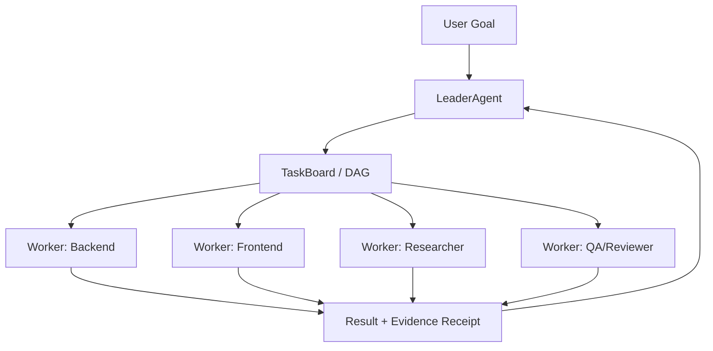

# Expert Panel System

The basic unit of LingXiao is not "an assistant" but a **Leader + Worker expert panel**. You provide the goal; the Leader handles judgment, decomposition, planning, DAG construction, team assembly, and task dispatch. Worker experts execute research, frontend, backend, testing, review, documentation, and other work in parallel.

## Leader-Worker Architecture



### Leader Responsibilities

- Understand user goals and decompose them into a dependency-aware task graph (DAG)
- Select appropriate Worker roles based on task type
- Handle user confirmation and interaction
- Monitor execution progress, handle blockers and failures
- Verify task results, extract PASS/FAIL/BLOCKED verdicts
- Coordinate cross-task dependencies, wrap up and summarize

### Worker Responsibilities

- Receive tasks dispatched by the Leader, execute in independent processes
- Have independent context, tool calls, runtime state, and logs
- Submit results and verification evidence via `attempt_completion`
- Report progress or request help via `send_message`

## 13 Preset Roles

| Role | Identifier | Responsibilities |
| --- | --- | --- |
| Architect | `architect` | Architecture design, interface boundaries, module decomposition, risk control |
| Backend | `backend` | Backend implementation, state machines, APIs, databases, task scheduling |
| Frontend | `frontend` | WebUI/TUI interaction, state projection, visualization workbench |
| Fullstack | `fullstack` | Cross-stack implementation, contract-first, end-to-end verification |
| Coding | `coding` | General coding implementation |
| Research | `research` | Research, solution comparison, external verification |
| Explore | `explore` | Code exploration, architecture understanding, entry point localization |
| Verify | `verify` | Verification, regression testing, build checks |
| Review | `review` | Code review, quality assessment |
| QA | `qa` | Test case writing, quality assurance |
| Planner | `planner` | Planning, task decomposition |
| Evaluator | `evaluator` | Evaluation, acceptance |
| UX Designer | `ux_designer` | Usability review, interaction design |

## Process Isolation and Communication

Each Worker runs in an independent process, communicating with the Leader via IPC:

- **Heartbeat mechanism**: 30-second heartbeat timeout for automatic Worker liveness detection
- **State channel**: Worker state, logs, conversations, and results flow through agent communication channels
- **Supervision and intervention**: The Leader uses orchestration tools rather than process flags for supervision

## Custom Roles

LingXiao supports extending expert capabilities through multiple approaches:

1. **Role registration**: Define new roles in `builtinRoles.ts` or via the WebUI role management interface
2. **Skill system**: Bind domain knowledge and execution flows to roles via `skill_names`
3. **Tool permissions**: Configure allowed/requested tool sets per role
4. **Dynamic roles**: The Leader can dynamically create roles at runtime via `define_agent_role`

### Creating a Custom Role

```typescript
// Role definition example
{
  name: "security-auditor",
  description: "Security audit expert",
  systemPrompt: "You are a security audit expert...",
  allowedTools: ["code_search", "file_read", "shell"],
  skillNames: ["security-review"],
  suggestedModel: "claude-sonnet-4"
}
```

## Agent Panel

The WebUI Agent panel shows each Worker's real-time:

- Role identity and current task
- Tool call records (parameters, permissions, output, duration)
- Runtime status and live logs
- Result receipts and verification evidence
