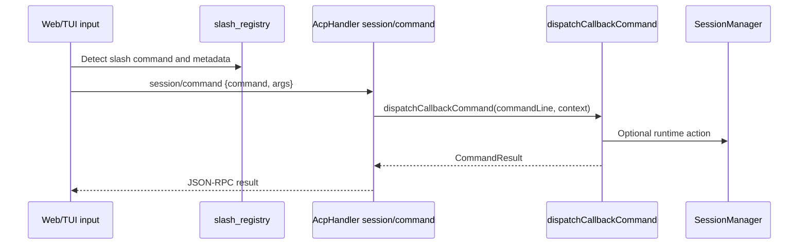

# Slash Commands

LingXiao has 66 built-in slash commands available in both TUI and WebUI chat input. Commands are registered in `src/commands/slash_registry.ts` and dispatched by `src/commands/dispatcher.ts`.

## Command Lifecycle

## Handler Types

| Handler | Meaning | Notes |
| --- | --- | --- |
| `tui-local` | Client handles locally without backend call | For view switches, help, exit |
| `callback` | Must be sent to backend dispatcher | For runtime state, sessions, tools, permissions, models, workflow |

## Categories

| Category | Purpose |
| --- | --- |
| `session` | Session lifecycle and history |
| `view` | TUI/Web panels and reports |
| `permission` | Tool permission and approval controls |
| `project` | Orchestration project controls |
| `model` | Models, language, and configuration |
| `tools` | Runtime tools, plugins, network helpers, skills |
| `misc` | Help, doctor, quit, and uncategorized commands |

## Session Commands

| Command | Handler | Description |
| --- | --- | --- |
| `/resume` | callback | Restore a session or open resume modal |
| `/session` | callback | Show current session/workspace/permission summary |
| `/clear` | callback | Clear current conversation in DB and memory |
| `/compact` | callback | Force Leader context compression |
| `/fork` | callback | `/fork [messageId]`; fork session from a message (registered but currently non-functional) |
| `/dream` | callback | Consolidate checkpoints into structured `MEMORY.md` |
| `/history` | callback | Recent sessions modal |
| `/stop` | callback | Interrupt current session |

## View Commands

| Command | Handler | Description |
| --- | --- | --- |
| `/tasks` | tui-local | Open task board/DAG view |
| `/agents` | tui-local | Open agent overview |
| `/graph` | tui-local | Open graph/blackboard view |
| `/notes` | tui-local | Open work notes |
| `/git` | tui-local | Open Git workspace panel |
| `/changes` | callback | File changes/checkpoint report |
| `/main` | tui-local | Return to main channel |
| `/refresh` | callback | Hydrate current session snapshot |
| `/reset` | tui-local | Reset current view |

## Permission Commands

| Command | Handler | Description |
| --- | --- | --- |
| `/permissions` | callback | Permission effective/layer/pending request modal |
| `/mode` | callback | `/mode <strict\|dev\|networked\|yolo> [session\|project\|local\|user]` |
| `/allow-tool` | callback | Add allow rule |
| `/deny-tool` | callback | Add deny rule |
| `/ask-tool` | callback | Add ask rule |
| `/approve` | callback | Approve pending permission or plan |
| `/deny` | callback | Deny pending permission request |

### Permission Layer Destinations

`/mode`, `/allow-tool`, `/deny-tool`, `/ask-tool` persist to different layers:

- `session`: SQLite `session_state`, key `TOOL_PERMISSION_CONTEXT`
- `project`: `.lingxiao/permissions.project.json`
- `local`: `.lingxiao/permissions.local.json`
- `user`: `~/.lingxiao/permissions.user.json`

Defaults to `session` when not specified.

## Project Orchestration Commands

| Command | Handler | Description |
| --- | --- | --- |
| `/eternal` | callback | `/eternal <goal>\|status\|pause\|resume\|clear\|delete\|set`; manage Eternal long-term goal |
| `/team` | callback | `/team status\|on\|off`; show or switch collaboration mode |
| `/route` | callback | `/route <auto\|direct\|hybrid\|delegate>`; set Leader execution route preference |
| `/projects` | callback | Orchestration project board |
| `/project-pause` | callback | Pause current project |
| `/project-resume` | callback | Resume current project |
| `/project-priority` | callback | `/project-priority <critical\|high\|normal\|low>` |
| `/project-replan` | callback | Force current project to replan |
| `/project-reset` | callback | Force recovery/reset for current project |
| `/project-unblock` | callback | `/project-unblock <dependency-id>` |
| `/project-archive` | callback | Archive current project |
| `/intervene` | callback | `/intervene @agent <message>` |
| `/cancel-task` | callback | `/cancel-task <task-id> [reason]` |
| `/broadcast` | callback | Broadcast message to all agents |

## Model & Configuration Commands

| Command | Handler | Description |
| --- | --- | --- |
| `/models` | callback | List configured models grouped by provider |
| `/model` | callback | `/model <model-id>`; update Leader model and persist |
| `/language` | tui-local | `/language <zh\|en>` |
| `/config` | tui-local | `/config \| /config set <key> <value> \| /config reset <key> \| /config reset-all \| /config init` |

## Tools & Plugin Commands

| Command | Handler | Description |
| --- | --- | --- |
| `/bughunt` | callback | `/bughunt [target]`; start or resume bughunt ledger |
| `/bughunt-status` | callback | Show bughunt ledger summary |
| `/bughunt-report` | callback | Generate bughunt report from ledger |
| `/office` | callback | `/office [on\|off]`; toggle office plugin |
| `/workflow` | callback | `/workflow [on\|off]`; toggle workflow tool injection |
| `/skills` | callback | Skill source and role skill modal |
| `/hooks` | callback | Hooks configuration report |
| `/fetch` | callback | `/fetch <url>`; fetch URL content |
| `/search` | callback | `/search <query>`; web search helper |
| `/ls` | callback | `/ls <path>`; directory preview |
| `/open` | callback | `/open <path>`; read first 200 lines |
| `/loop` | callback | `/loop [interval] <prompt>`; loop task management |

### Plugin Toggle Semantics

| Command | Session Key | Runtime Effect |
| --- | --- | --- |
| `/office` | `OFFICE_MODE_ACTIVE` | Enables office document/canvas capabilities |
| `/workflow` | `WORKFLOW_MODE_ACTIVE` | Exposes workflow leader tools |

## MCP Commands

`/mcp` is the slash-command surface for MCP server management, sharing the same config and runtime client as the `mcp` ToolRegistry tool.

| Subcommand | Description |
| --- | --- |
| `/mcp list` | List configured servers |
| `/mcp search <query>` | Dynamically query marketplace sources |
| `/mcp install <entry-id>` | Install a marketplace MCP entry |
| `/mcp tools [server-id]` | Inspect server-exposed tools |
| `/mcp call <server-id> <tool-name> [args]` | Call a server tool |
| `/mcp resources [server-id]` | Inspect server resources |
| `/mcp read-resource <server-id> <uri>` | Read a server resource |
| `/mcp prompts [server-id]` | Inspect server prompts |
| `/mcp get-prompt <server-id> <prompt-name> [args]` | Get a prompt |
| `/mcp templates [server-id]` | List resource templates |
| `/mcp snapshot [server-id]` | Show initialize capability snapshot |
| `/mcp add-remote <id> <url> [name]` | Create a streamable-http server |
| `/mcp add-stdio <id> <command> [args...]` | Create a stdio server |

## Other Commands

| Command | Handler | Description |
| --- | --- | --- |
| `/help` | tui-local | Show grouped help |
| `/doctor` | callback | Runtime diagnostics modal |
| `/quit` | tui-local | Exit client |
| `/exit` | tui-local | Exit client |

## Command Result Types

Each command result carries a `content` string and optional `type`. Results are discriminated by `action`:

| Type | action | Extra Fields |
| --- | --- | --- |
| `CommandMessageResult` | none | none, plain system message |
| `CommandResumeModalResult` | `resume_modal` | `sessions` |
| `CommandItemsModalResult` | `history_modal` / `skills_modal` / `doctor_modal` / `permissions_modal` / `projects_modal` | `items` |
| `CommandReportModalResult` | `report_modal` | `title`, `report` |
| `CommandHydrateResult` | `hydrate` | `sessionStatus`, `tasks`, `messages`, `channels`, `tokenUsage?`, `agentTokens?`, `leaderStatus`, `leaderMode?`, `leaderReason?` |

## Known Gaps

- `/fork` is registered as `callback` type but has no handler in `dispatcher.ts` `commandRegistry`; currently non-functional.

## Evolution Rules

1. Register every new slash command in `slash_registry.ts`
2. Add callback behavior in `dispatcher.ts` when `handledBy` is `callback`
3. Update Web autocomplete only after the backend registry exists
4. New command result actions must be documented here and handled by the target client
5. Synonymous commands (e.g. `/quit` and `/exit`) are registered as separate entries; command names are not normalized
