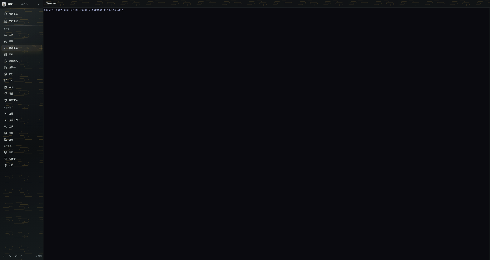

# 第一次运行

## 启动凌霄

```bash
lingxiao
```

启动后你会看到 TUI 界面和 WebUI 地址。默认端口信息写入：

```text
~/.lingxiao/port
```

## 发送第一个目标

在 TUI 或 WebUI 中输入你的工程目标，例如：

> 帮我创建一个 Express REST API，包含用户 CRUD 和 JWT 鉴权

<div class="doc-vertical-flow">
  <strong>Leader 调度流程</strong>
  <span>理解目标并拆解任务</span>
  <span>构建 DAG 任务图</span>
  <span>组建专家团（Architect、Backend、QA 等）</span>
  <span>派发任务给 Worker</span>
  <span>监督执行和验收</span>
  <span>汇总结果</span>
</div>

## 观察运行态

### WebUI 指挥中心

打开终端打印的 WebUI 地址，你可以看到：

- **任务面板**：DAG 可视化、任务状态流转
- **Agent 面板**：各 Worker 的角色、进度和输出
- **工具调用**：每次工具的参数、权限和结果
- **代码变更**：文件 diff 和 Git 操作


### TUI 界面

TUI 实时显示任务列表、Agent 状态和工具调用。



## 会话管理

```bash
# 列出所有会话
lingxiao list

# 恢复会话
lingxiao --session <session_id>
```

所有会话状态持久化到 SQLite，崩溃后可恢复。

## 常用命令

| 命令 | 说明 |
| --- | --- |
| `lingxiao` | 启动 TUI + WebUI |
| `lingxiao --session <id>` | 恢复指定会话 |
| `lingxiao list` | 列出所有会话 |
| `lingxiao doctor` | 环境诊断 |
